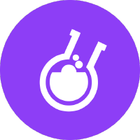

<p align="center">
    <a href="https://www.letsdeliverbr.com/" target="_blank"> 
            
    </a>
</p>

## 🚀 Começando

Olá! Este repositório contém a minha solução para o desafio da Corelab. Trata-se de um sistema simples em Laravel/React para gerenciar anotações e lembretes de usuários.

Siga as **instruções** abaixo para configurar o ambiente e rodar o projeto localmente.

### 📋 Pré-requisitos

Antes de começar, verifique se você possui as seguintes dependências instaladas. Caso contrário, faça o download e instale-as para prosseguir:

* [Git](https://git-scm.com/downloads) 
* [NPM (8.5.5)](https://www.npmjs.com/)
* [Yarn](https://yarnpkg.com/)
* [Node (16.15.0)](https://nodejs.org/en/)

### 🔧 Instalação

Após ter configurado o ambiente, siga as etapas abaixo para instalar o projeto localmente

1. Certifique-se de que você está autenticado no GitHub e, em seguida, clone o repositório:

```
git clone https://github.com/GiovaniAppezzato/corelab-challenge-web-app-php
```

2. Navegue até a pasta do projeto e execute o comando abaixo para instalar todas as dependências necessárias:

```
yarn install
```

3. Após a conclusão da instalação, crie o arquivo de configuração com o comando a seguir na raiz do projeto:

```
cp .env.example .env
```

4. Abra o arquivo `.env` e configure as variáveis de ambiente conforme necessário. Certifique-se de especificar o IP e a porta onde o backend está rodando:

```
# Example
REACT_APP_API_URL=http://127.0.0.1:8000 
```

5. Pronto! Agora você pode executar o projeto usando os seguinte comando:

```
yarn start --reset-cache
```
